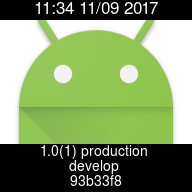
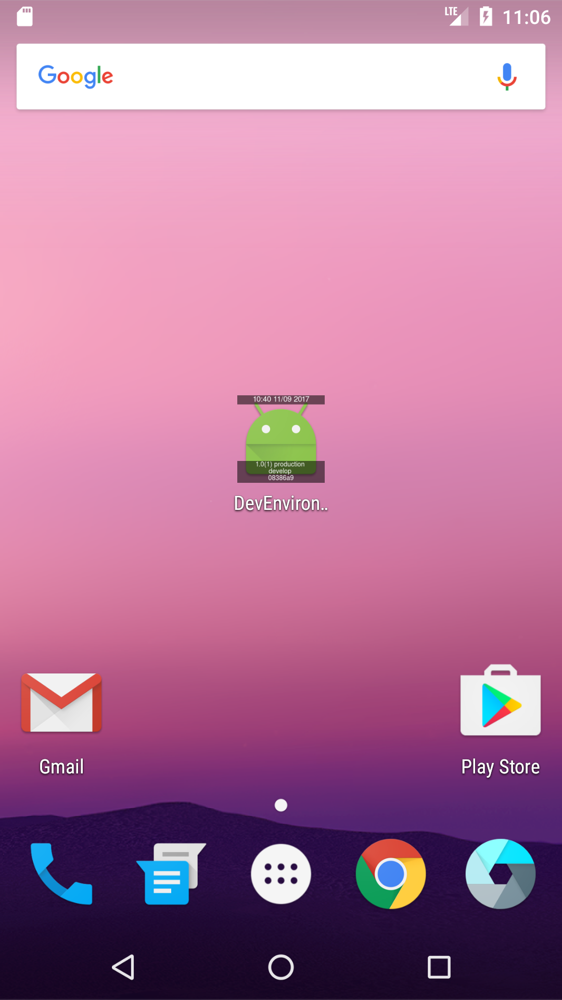

# IconHUD-Android

iOS version here.  
https://github.com/Tueno/IconHUD/

This is alpha version, so it is possible to have some bugs.

<p align="center">


</p>

## Features

* IconHUD places information of your app on icon. (version, branch, commit ID, build date, build flavor etc...)
* It does NOT process icon image file in your project's asset.
* It does NOT work on release build. (If BuildType name is "Release".)

## Installation
```
brew tap tueno/iconhud-android
brew install iconhud-android
```

## Usage

Add the script below to build.gradle(app).  
```
// iconhud
task iconhud {
    doLast {
        android.applicationVariants.all { variant ->
            variant.outputs.each { output ->
                exec {
                    executable "/usr/local/bin/iconhud-android"
                    args "--build-type-name", variant.buildType.name, "--build-flavor-name", variant.flavorName, "--output-path", output.outputFile
                    ignoreExitValue true
                }
            }
        }
    }
}
gradle.buildFinished { result ->
    if (!result.failure) {
        iconhud.execute()
    }
}
```

## Notice

* If you don't need to process icon on debug build, use `--ignore-debug-build` option.
